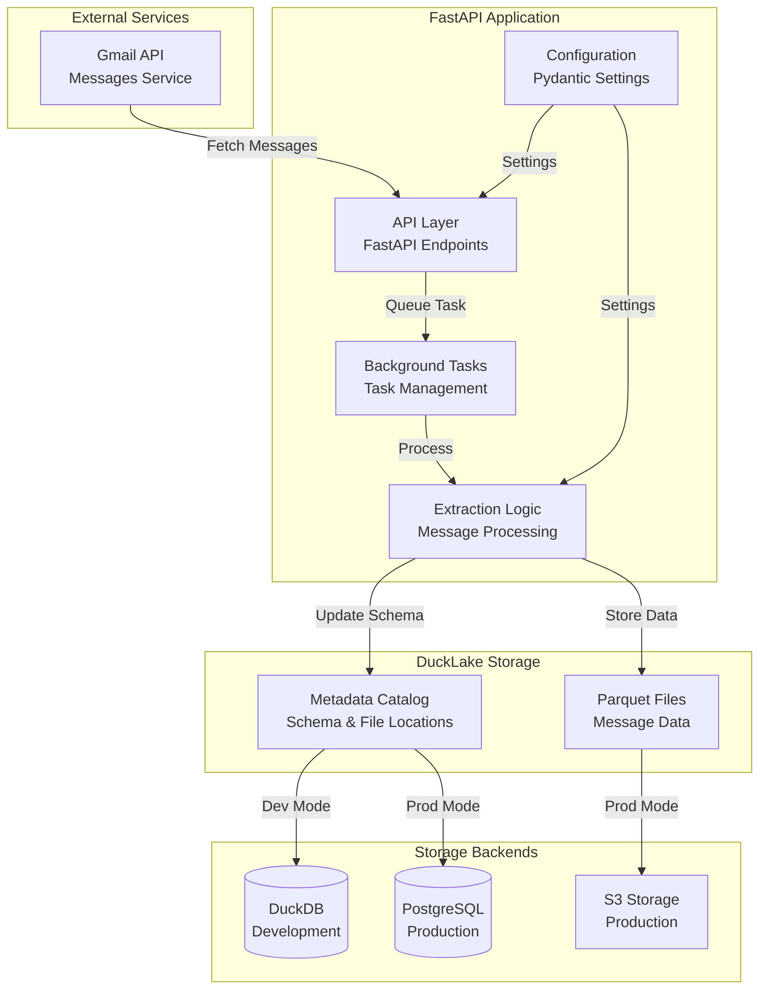
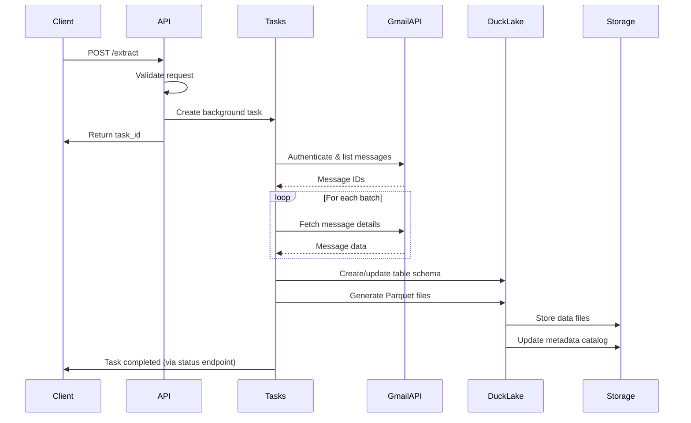
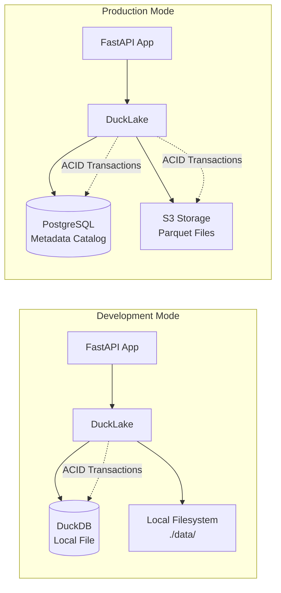
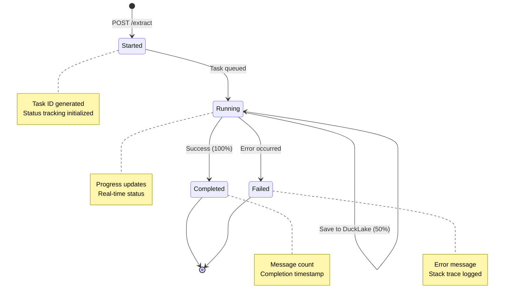

# Gmail DataLake Extractor Architecture

This document explains the system architecture, data flow, and key components of the Gmail DataLake Extractor service.

## System Overview

The Gmail DataLake Extractor is a FastAPI-based service that extracts Gmail messages and stores them in DuckLake, a modern data lake storage system with ACID transactions. The service provides asynchronous processing with background tasks and configurable storage backends.

## Architecture Diagram



## Core Components

### 1. API Layer (`api.py`)

**Responsibilities:**

- FastAPI endpoint definitions
- Request/response validation with Pydantic models
- Background task management
- Task status tracking

**Key Features:**

- Non-blocking message extraction via background tasks
- Real-time progress tracking
- Comprehensive error handling with stack traces
- In-memory task status storage (production should use Redis/database)

### 2. Message Extraction (`extract/extract.py`)

**Responsibilities:**

- Gmail API integration
- Message fetching with batch processing
- Retry logic with exponential backoff
- DuckLake storage integration

**Key Features:**

- Configurable batch sizes and retry policies
- Multiple message formats (metadata, full, minimal, raw)
- Automatic DuckLake table creation and data insertion
- Error handling and logging

### 3. Configuration Management (`config.py`)

**Responsibilities:**

- Environment variable management
- Pydantic-based settings validation
- Type-safe configuration classes

**Key Features:**

- Separate configuration classes for different concerns
- Environment file support
- Type hints and validation
- Case-insensitive environment variables

### 4. Data Models (`models.py`)

**Responsibilities:**

- Pydantic models for Gmail API responses
- Request/response validation
- Type safety for API interactions

**Key Features:**

- Complete Gmail API message structure modeling
- Configurable fetch parameters
- Type-safe data validation

## Data Flow

### Message Extraction Process



## Storage Architecture

### DuckLake Configuration



**Current DuckLake Implementation:**

- **Metadata Catalog**: Stores table schemas and file locations
- **Data Storage**: Parquet files for efficient analytics
- **ACID Transactions**: Ensures data consistency
- **Multiple Backends**: DuckDB (dev) or PostgreSQL (prod) for metadata
- **SQL Configuration**: Setup files define storage backends and credentials

### Development Setup

```sql
CREATE secret my_ducklake (
    TYPE ducklake,
    metadata_path './data/messages.duckdb',
    data_path './data/',
    metadata_schema 'messages',
    encrypted FALSE
);
```

- **Metadata Catalog**: Local DuckDB file
- **Data Storage**: Local filesystem
- **Schema**: `messages` namespace
- **Encryption**: Disabled for development

### Production Setup

```sql
CREATE secret my_ducklake (
    TYPE ducklake,
    metadata_path 'postgres: user=postgres password=password host=host port=5433 dbname=ducklake_catalog',
    data_path 's3://messages',
    metadata_schema 'messages',
    encrypted TRUE
);
```

- **Metadata Catalog**: PostgreSQL database
- **Data Storage**: S3-compatible storage
- **Schema**: `messages` namespace
- **Encryption**: Enabled for production

## Background Task Processing

### Current Implementation

The system uses FastAPI's built-in background tasks with in-memory task status storage.



**Current Features:**

- **Progress Tracking**: 0% → 10% → 50% → 100% with status messages
- **Error Handling**: Comprehensive exception catching with stack traces
- **Retry Logic**: Configurable retry attempts with exponential backoff
- **In-Memory Storage**: Task status stored in application memory

**Limitations:**

- Task status lost on application restart
- Single instance deployment only
- No task persistence across failures

## Security Considerations

### Authentication

- Gmail API OAuth 2.0 tokens with `gmail.readonly` scope
- Token storage in secure file system or secret management
- Automatic token refresh handling

### Data Protection

- Encrypted DuckLake storage in production
- Secure credential management via Docker secrets
- Network security for PostgreSQL and S3 connections
- Proper IAM policies for cloud storage

### Configuration Security

- Environment-based configuration
- Sensitive data in Docker secrets
- SQL setup files with encrypted credentials
- Version-controlled configuration templates

## Scalability Considerations

### Current Implementation

**Implemented:**

- Stateless API design for load balancing
- Background task processing for non-blocking operations
- Batch processing for Gmail API calls
- Parquet format for efficient storage and querying
- Configurable batch sizes and retry policies
- Comprehensive logging with structured formats
- Health check endpoints for load balancer integration
- Task status tracking for progress monitoring

**Not Yet Implemented:**

- External task queue (Redis/database) for multi-instance deployment
- Connection pooling for database connections
- Advanced monitoring and observability
- Task persistence across application restarts

## Technology Stack

### Core Technologies

- **FastAPI**: Modern Python web framework with automatic API documentation
- **Pydantic**: Data validation and settings management
- **DuckLake**: Modern data lake storage with ACID transactions
- **DuckDB**: High-performance analytical database for metadata catalog
- **PostgreSQL**: Production metadata catalog backend
- **Gmail API**: Google's RESTful API for Gmail access

### Development Tools

- **uv**: Fast Python package manager
- **Docker**: Containerized deployment
- **Docker Compose**: Multi-container orchestration
- **Jupyter**: Interactive data exploration notebooks

### Data Formats

- **Parquet**: Columnar storage format for analytics
- **JSON**: API request/response format
- **SQL**: DuckLake configuration and queries
